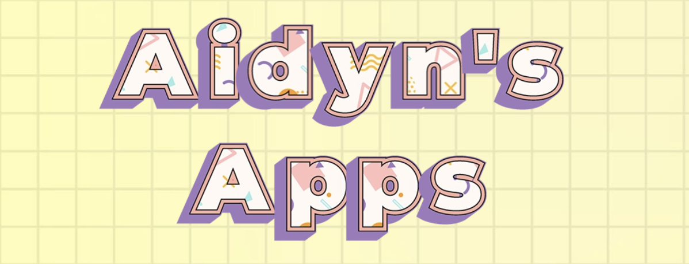

# Egg Timer

## Why I did this app?
I build this app when taking course in Udemy. The course is "iOS & Swift - The Complete iOS App Development Bootcamp". 

## What You'll Make

I have build a beautiful egg timer app to boil your eggs to perfection depending on how you prefer your eggs. 

## What I learn

* Swift Collection types - Dictionaries
* The Swift Timer API
* Conditional statements - IF/ELSE
* Conditional statements - Switch
* Functions with outputs
* How to use the ProgressView

